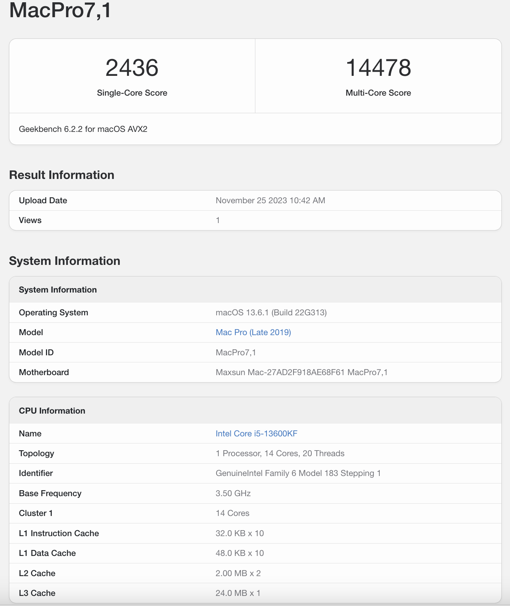
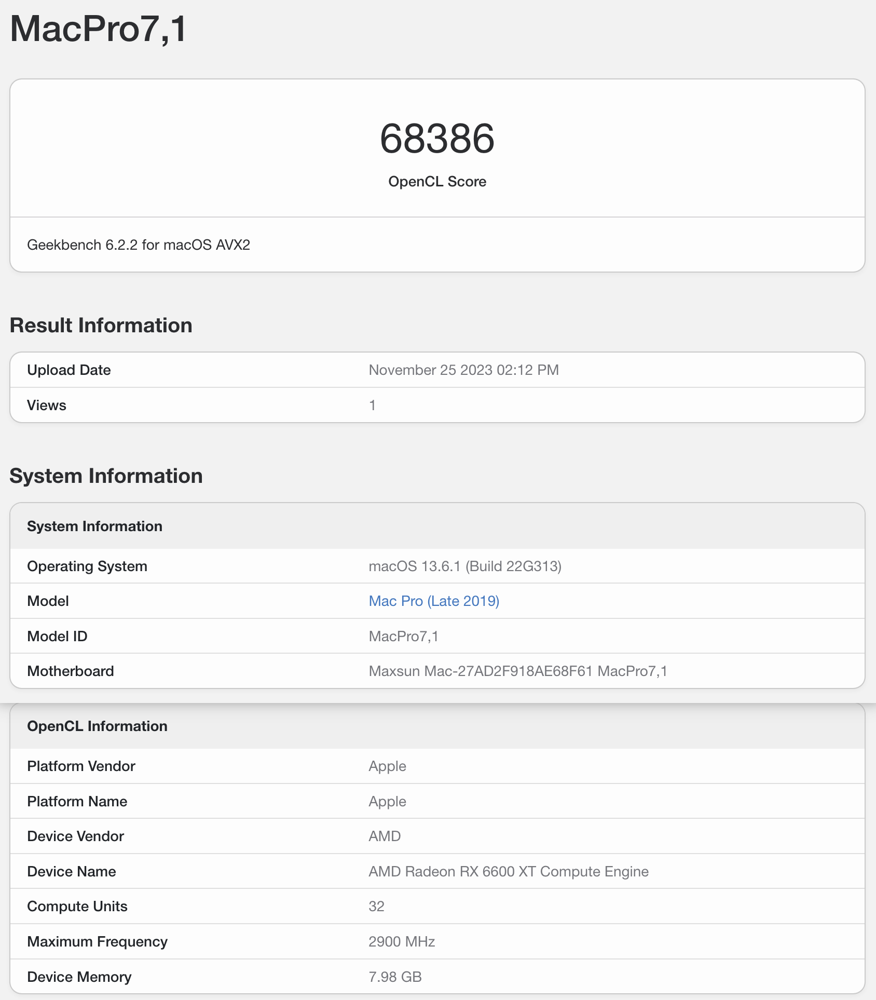

# 铭瑄电竞之心 Z690ITX Hickintosh

## 配置详情

**主板**：MS-iCraft Z690ITX WIFI  
**CPU**：英特尔 ® 酷睿 ™ i5-13600KF 处理器  
**GPU**：RX580/RX6600xt/RX6800xt(其他显卡自测)  
**网卡**：AX211  
**声卡**：ALC897  

## 性能

## 细节

**OpenCore**：1.0.4

## 问题

- 开机音频问题
- 隔空投送无法找到设备

## 相关文档

- [OpenCore](https://dortania.github.io/OpenCore-Install-Guide/)官方
- [Opencore](https://oc.skk.moe/)参考手册
- [国光黑苹果](https://apple.sqlsec.com/)
- [itlwm](https://github.com/OpenIntelWireless/itlwm) - intel 网卡驱动

## 最后

**觉得有用的点个star吧**
